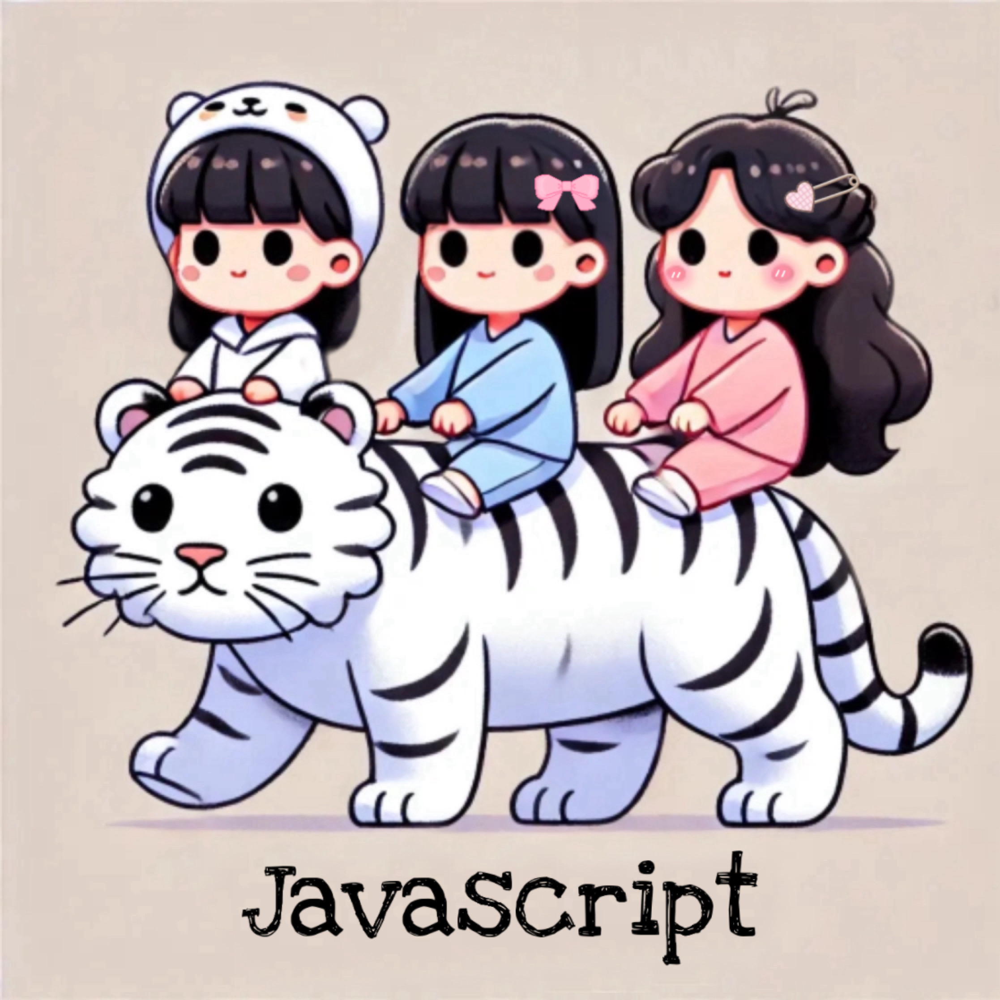

 

    
# 👨‍💻React 공식문서 스터디👨‍💻

    
|인원 | 박수미, 임현아, 서샛별 |
| --- | :-- |
|기간 | 2024-07-08~2024-08-11|
|시간 | 21:00~23:00
|목표 | 코어 자바스크립트 완독하기|
| 내용 |<li>매주 코어 자바스크립트 내용 숙지하고 정리하기</li>
| |<li>매주 금요일 발표(발표직전 랜덤으로 발표자 지정)</li>|

| 주차 | 기간 | 범위 | 발표자 |
| --- | --- | --- | --- |
| 1주차 | 7/8 ~ 7/14 | 1장 데이터 타입 , 2장 실행 컨텍스트 |  |
| 2주차 | 7/15 ~ 7/21 | 3장 this , 4장 콜백 함수 |  |
| 3주차 | 7/22 ~ 7/28 | 5장 클로저 |  |
| 4주차 | 7/29 ~ 8/4 | 6장 프로토타입 |  |
| 5주차 | 8/5 ~ 8/11 | 7장 클래스 |  |

|  |  |  | 
| :---: | :---: | :---: |
|https://github.com/sumii-7|https://github.com/lyuna29|https://github.com/ssbmel|

